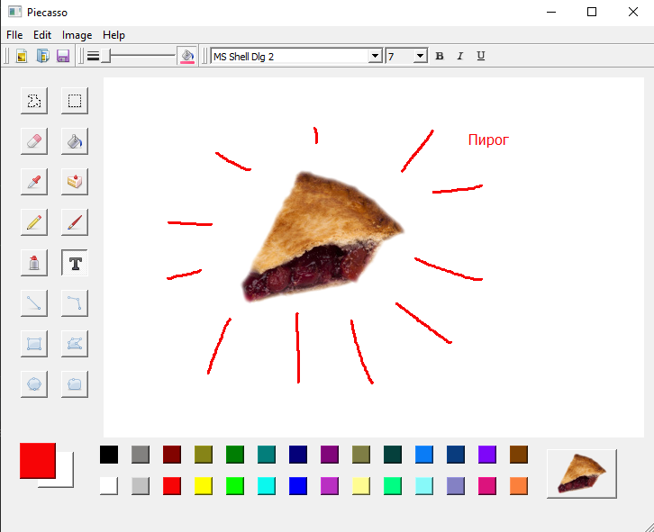

Piecasso — Графическое приложение для рисования 
на рабочем столе с использованием PyQt

Выразите себя с помощью PieCasso, единственной 
программы для рисования, в которой есть готовые 
изображения пирогов.

Piecasso является клоном программы Paint из 
Windows 95 (примерно) с несколькими добавлениями 
(и убираниями). Программа включает стандартные 
инструменты, такие как перо, кисть, заливка, 
аэрозоль, ластик, текст и несколько форм.

Заметки по коду

Обработка событий
Все инструменты реализованы с помощью вложенных 
обработчиков событий, которые перенаправляют 
события по мере необходимости. Это позволяет 
многократно использовать код между инструментами, 
которые имеют общие поведения (например, рисование форм). 
Для добавления анимации выбора области требуется таймер 
(для обновления "муравьев"), что добавляет некоторую сложность.

Заливка области

Это была самая сложная часть этого приложения с точки зрения 
производительности. Проверка пикселей непосредственно слишком 
медленна (время заливки всего холста около 10 секунд). 
Большинство кодов для достижения этого в Python разумно 
используют numpy, но я не хотел вводить зависимость только 
из-за этого.

Экспортировав изображение в виде строки байтов, затем уменьшив 
его до булевой строки байтов (для сравнения совпадений/несовпадений), 
я смог достичь приемлемой скорости.

Однако алгоритм поиска для заливки всё еще довольно туповатый.

